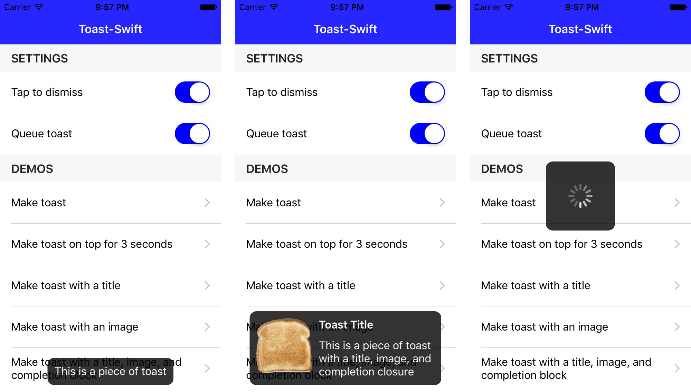

Toast-Swift
=============

[](https://travis-ci.org/scalessec/Toast-Swift)
[](http://cocoadocs.org/docsets/Toast-Swift)
[](https://github.com/Carthage/Carthage)

Toast-Swift is a Swift extension that adds toast notifications to the `UIView` object class. It is intended to be simple, lightweight, and easy to use. Most toast notifications can be triggered with a single line of code.

**Toast-Swift is a native Swift port of [Toast for iOS](https://github.com/scalessec/Toast "Toast for iOS").**

Screenshots
---------



Basic Examples
---------
```swift
// basic usage
self.view.makeToast("This is a piece of toast")

// toast with a specific duration and position
self.view.makeToast("This is a piece of toast", duration: 3.0, position: .top)

// toast presented with multiple options and with a completion closure
self.view.makeToast("This is a piece of toast", duration: 2.0, point: CGPoint(x: 110.0, y: 110.0), title: "Toast Title", image: UIImage(named: "toast.png")) { didTap in
    if didTap {
        print("completion from tap")
    } else {
        print("completion without tap")
    }
}

// display toast with an activity spinner
self.view.makeToastActivity(.center)

// display any view as toast
self.view.showToast(myView)

// immediately hides all toast views in self.view
self.view.hideAllToasts()
```

But wait, there's more!
---------
```swift
// create a new style
var style = ToastStyle()

// this is just one of many style options
style.messageColor = .blue

// present the toast with the new style
self.view.makeToast("This is a piece of toast", duration: 3.0, position: .bottom, style: style)

// or perhaps you want to use this style for all toasts going forward?
// just set the shared style and there's no need to provide the style again
ToastManager.shared.style = style
self.view.makeToast("This is a piece of toast") // now uses the shared style

// toggle "tap to dismiss" functionality
ToastManager.shared.isTapToDismissEnabled = true

// toggle queueing behavior
ToastManager.shared.isQueueEnabled = true
```

See the demo project for more examples.


Setup Instructions
------------------

[CocoaPods](http://cocoapods.org)
------------------

To integrate Toast-Swift into your Xcode project using CocoaPods, specify it in your `Podfile`:

```ruby
pod 'Toast-Swift', '~> 5.0.0'
```

and in your code add `import Toast_Swift`.

[Carthage](https://github.com/Carthage/Carthage)
------------------

To integrate Toast-Swift into your Xcode project using Carthage, specify it in your `Cartfile`:

```ogdl
github "scalessec/Toast-Swift" ~> 5.0.0
```

Run `carthage update` to build the framework and drag the built `ToastSwiftFramework.framework` into your Xcode project.

and in your code add `import ToastSwiftFramework`.

Manually
------------------

1. Add `Toast.swift` to your project.
2. Grab yourself a cold 🍺.

Compatibility
------------------
* Version `5.x.x` requires Swift 5 and Xcode 10.2.
* Version `4.x.x` requires Swift 4.2 and Xcode 10.
* Version `3.x.x` requires Swift 4 and Xcode 9.
* Version `2.x.x` requires Swift 3 and Xcode 8.
* Version `1.4.x` requires Swift 2.2 and Xcode 7.3. 
* Version `1.0.0` can be used with Swift 2.1 and earlier versions of Xcode.
 
MIT License
-----------
    Copyright (c) 2015-2019 Charles Scalesse.

    Permission is hereby granted, free of charge, to any person obtaining a
    copy of this software and associated documentation files (the
    "Software"), to deal in the Software without restriction, including
    without limitation the rights to use, copy, modify, merge, publish,
    distribute, sublicense, and/or sell copies of the Software, and to
    permit persons to whom the Software is furnished to do so, subject to
    the following conditions:

    The above copyright notice and this permission notice shall be included
    in all copies or substantial portions of the Software.

    THE SOFTWARE IS PROVIDED "AS IS", WITHOUT WARRANTY OF ANY KIND, EXPRESS
    OR IMPLIED, INCLUDING BUT NOT LIMITED TO THE WARRANTIES OF
    MERCHANTABILITY, FITNESS FOR A PARTICULAR PURPOSE AND NONINFRINGEMENT.
    IN NO EVENT SHALL THE AUTHORS OR COPYRIGHT HOLDERS BE LIABLE FOR ANY
    CLAIM, DAMAGES OR OTHER LIABILITY, WHETHER IN AN ACTION OF CONTRACT,
    TORT OR OTHERWISE, ARISING FROM, OUT OF OR IN CONNECTION WITH THE
    SOFTWARE OR THE USE OR OTHER DEALINGS IN THE SOFTWARE.
